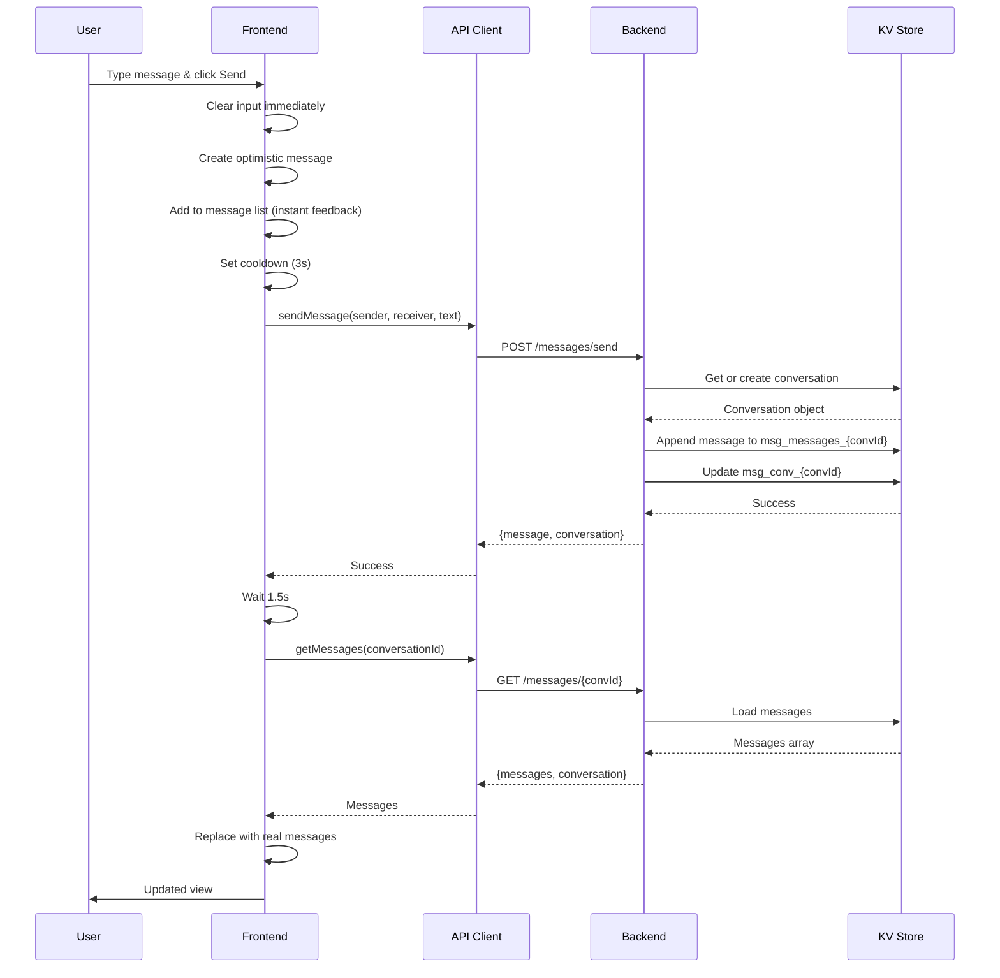
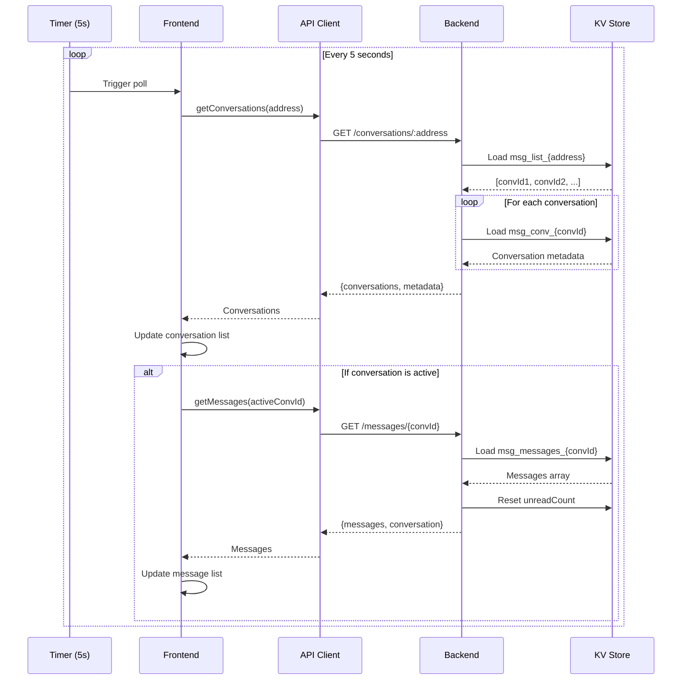
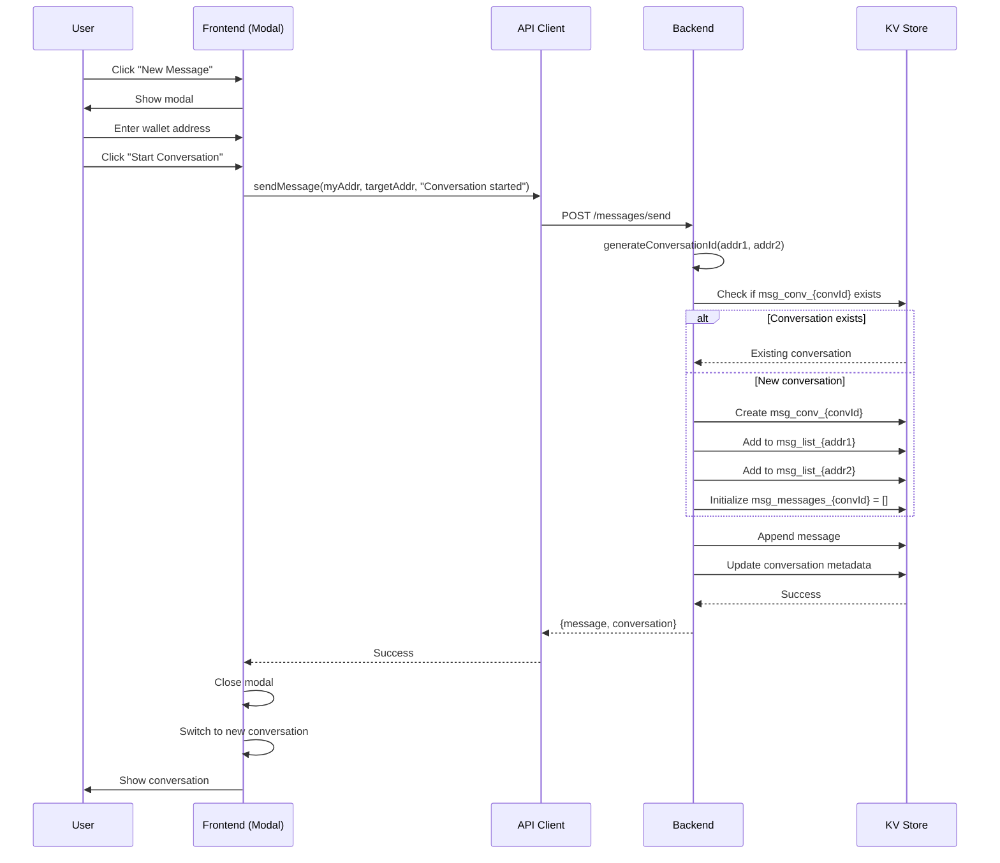

# 📱 Orina Messenger - Tài Liệu Kỹ Thuật

> **Version:** 1.0  
> **Last Updated:** February 13, 2026  
> **Author:** Orina Development Team

---

## 📋 Mục Lục

1. [Tổng Quan](#1-tổng-quan)
2. [Kiến Trúc Hệ Thống](#2-kiến-trúc-hệ-thống)
3. [Database Schema](#3-database-schema)
4. [API Endpoints](#4-api-endpoints)
5. [Frontend Integration](#5-frontend-integration)
6. [Tính Năng](#6-tính-năng)
7. [Flow Diagrams](#7-flow-diagrams)
8. [Code Examples](#8-code-examples)
9. [Troubleshooting](#9-troubleshooting)
10. [Security](#10-security)

---

## 1. Tổng Quan

### 1.1. Giới Thiệu

**Orina Messenger** là hệ thống nhắn tin peer-to-peer được tích hợp trong Web3 Analytics Dashboard, cho phép người dùng giao tiếp trực tiếp qua wallet address mà không cần thông tin cá nhân.

### 1.2. Đặc Điểm Chính

- ✅ **Wallet-based messaging**: Giao tiếp qua wallet address (không cần email/phone)
- ✅ **Real-time polling**: Cập nhật tin nhắn mỗi 5 giây
- ✅ **Optimistic updates**: Hiển thị tin nhắn ngay lập tức
- ✅ **Image support**: Gửi ảnh qua IPFS
- ✅ **AI Agent integration**: Hỗ trợ tự động trả lời bằng AI
- ✅ **Unread tracking**: Theo dõi tin nhắn chưa đọc
- ✅ **Emoji picker**: 45 emojis tích hợp sẵn
- ✅ **Copy to clipboard**: Copy wallet address dễ dàng
- ✅ **Report system**: Báo cáo người dùng vi phạm

### 1.3. Tech Stack

| Layer | Technology |
|-------|-----------|
| Frontend | React, TypeScript, Tailwind CSS |
| Backend | Supabase Edge Functions (Deno + Hono) |
| Database | Supabase KV Store (PostgreSQL) |
| Storage | IPFS (Pinata) |
| Auth | Wallet-based (no password) |
| Real-time | HTTP Polling (5s interval) |

---

## 2. Kiến Trúc Hệ Thống

### 2.1. Architecture Diagram

```
┌─────────────────────────────────────────────────────────────────┐
│                        FRONTEND (React)                          │
│  ┌─────────────────┐  ┌──────────────┐  ┌──────────────────┐  │
│  │ Messages.tsx    │  │ Emoji Picker │  │ Image Uploader   │  │
│  │ Component       │  │              │  │                  │  │
│  └────────┬────────┘  └──────────────┘  └──────────────────┘  │
│           │                                                      │
│           │ import MessagesClient                                │
│           ▼                                                      │
│  ┌──────────────────────────────────────────────────────────┐  │
│  │         messagesClient.ts (API Client)                    │  │
│  │  - sendMessage()                                          │  │
│  │  - getConversations()                                     │  │
│  │  - getMessages()                                          │  │
│  │  - markAsRead()                                           │  │
│  └────────┬─────────────────────────────────────────────────┘  │
└───────────┼─────────────────────────────────────────────────────┘
            │
            │ HTTPS (Authorization: Bearer ${publicAnonKey})
            ▼
┌─────────────────────────────────────────────────────────────────┐
│           SUPABASE EDGE FUNCTION (Deno + Hono)                  │
│  ┌──────────────────────────────────────────────────────────┐  │
│  │         messages-handler.ts (HTTP Handlers)              │  │
│  │  - handleSendMessage()       POST /messages/send         │  │
│  │  - handleGetConversations()  GET  /conversations/:addr   │  │
│  │  - handleGetMessages()       GET  /messages/:convId      │  │
│  │  - handleMarkAsRead()        POST /messages/read         │  │
│  │  - handleDeleteConversation() DEL /messages/:convId      │  │
│  └────────┬─────────────────────────────────────────────────┘  │
│           │                                                      │
│           │ import KV Store                                      │
│           ▼                                                      │
│  ┌──────────────────────────────────────────────────────────┐  │
│  │         kv_store.tsx (Database Layer)                     │  │
│  │  - get(key)                                               │  │
│  │  - set(key, value)                                        │  │
│  │  - mget([keys])                                           │  │
│  │  - mset([{key, value}])                                   │  │
│  └────────┬─────────────────────────────────────────────────┘  │
└───────────┼─────────────────────────────────────────────────────┘
            │
            ▼
┌─────────────────────────────────────────────────────────────────┐
│               SUPABASE POSTGRESQL (KV Store)                    │
│  ┌──────────────────────────────────────────────────────────┐  │
│  │  Key-Value Store: kv_store_b0d68fc8                      │  │
│  │  ┌────────────────────┬─────────────────────────────────┐│  │
│  │  │ Key                │ Value (JSONB)                    ││  │
│  │  ├────────────────────┼─────────────────────────────────┤│  │
│  │  │ msg_list_{address} │ ["conv_id1", "conv_id2", ...]   ││  │
│  │  │ msg_conv_{convId}  │ Conversation metadata           ││  │
│  │  │ msg_messages_{id}  │ [Message, Message, ...]         ││  │
│  │  └────────────────────┴─────────────────────────────────┘│  │
│  └──────────────────────────────────────────────────────────┘  │
└─────────────────────────────────────────────────────────────────┘
```

### 2.2. Data Flow

#### **Sending a Message:**

```
User types message → Click Send
    ↓
Frontend: Optimistic Update (show immediately)
    ↓
API: POST /messages/send {sender, receiver, text, image}
    ↓
Backend: createOrGetConversation()
    ↓
Backend: Create Message object
    ↓
KV Store: Append to msg_messages_{convId}
    ↓
KV Store: Update msg_conv_{convId} (lastMessage, unreadCount)
    ↓
Response: {message, conversation}
    ↓
Frontend: Reload messages after 1.5s
```

#### **Receiving Messages (Polling):**

```
Every 5 seconds:
    ↓
API: GET /messages/conversations/{address}
    ↓
Backend: Load user's conversation list
    ↓
Response: Array of conversations with unread counts
    ↓
Frontend: Update conversation list
    ↓
If conversation is active:
    API: GET /messages/{conversationId}?userAddress={addr}
        ↓
    Backend: Load messages + mark as read
        ↓
    Response: Array of messages
        ↓
    Frontend: Update message list
```

---

## 3. Database Schema

### 3.1. KV Store Keys

| Key Pattern | Value Type | Description | Example |
|-------------|-----------|-------------|---------|
| `msg_list_{address}` | `string[]` | Danh sách conversation IDs của user | `["conv_0x123_0xabc", "conv_0x123_0xdef"]` |
| `msg_conv_{conversationId}` | `Conversation` | Metadata của conversation | See 3.2 |
| `msg_messages_{conversationId}` | `Message[]` | Tất cả messages trong conversation | See 3.3 |

### 3.2. Conversation Object

```typescript
interface Conversation {
  id: string;                          // "conv_{address1}_{address2}"
  participants: string[];              // [address1, address2] (sorted lowercase)
  createdAt: string;                   // ISO 8601 timestamp
  lastMessage: string;                 // Text của message cuối cùng
  lastMessageTime: string;             // ISO 8601 timestamp
  unreadCount: {                       // Unread count per user
    [address: string]: number;         // Key: lowercase address, Value: count
  };
}
```

**Example:**
```json
{
  "id": "conv_0x1234567890abcdef_0xfedcba0987654321",
  "participants": [
    "0x1234567890abcdef",
    "0xfedcba0987654321"
  ],
  "createdAt": "2026-02-13T10:30:00.000Z",
  "lastMessage": "Hello! How are you?",
  "lastMessageTime": "2026-02-13T15:45:22.000Z",
  "unreadCount": {
    "0x1234567890abcdef": 0,
    "0xfedcba0987654321": 3
  }
}
```

### 3.3. Message Object

```typescript
interface Message {
  id: string;                          // "msg_{timestamp}_{random}"
  conversationId: string;              // Reference to conversation
  sender: string;                      // Wallet address (lowercase)
  receiver: string;                    // Wallet address (lowercase)
  text: string;                        // Message content
  timestamp: string;                   // ISO 8601 timestamp
  read: boolean;                       // Read status (deprecated, use conversation.unreadCount)
  image?: {                            // Optional image attachment
    url: string;                       // IPFS URL or data URL
    ipfsHash?: string;                 // IPFS hash if uploaded
  };
  isAI?: boolean;                      // True if sent by AI Agent
}
```

**Example:**
```json
{
  "id": "msg_1707829522000_abc123xyz",
  "conversationId": "conv_0x1234567890abcdef_0xfedcba0987654321",
  "sender": "0x1234567890abcdef",
  "receiver": "0xfedcba0987654321",
  "text": "Hello! How are you?",
  "timestamp": "2026-02-13T15:45:22.000Z",
  "read": false,
  "image": {
    "url": "https://gateway.pinata.cloud/ipfs/Qm...",
    "ipfsHash": "Qm..."
  },
  "isAI": false
}
```

### 3.4. Conversation ID Generation

Để đảm bảo 2 users luôn có cùng conversation ID, addresses được sort trước khi hash:

```typescript
function generateConversationId(address1: string, address2: string): string {
  const sorted = [address1.toLowerCase(), address2.toLowerCase()].sort();
  return `conv_${sorted[0]}_${sorted[1]}`;
}

// Example:
generateConversationId("0xAAA", "0xBBB") === "conv_0xaaa_0xbbb"
generateConversationId("0xBBB", "0xAAA") === "conv_0xaaa_0xbbb" // Same!
```

---

## 4. API Endpoints

Base URL: `https://{projectId}.supabase.co/functions/v1/make-server-b0d68fc8/messages`

### 4.1. POST `/send` - Gửi Tin Nhắn

**Request:**
```http
POST /make-server-b0d68fc8/messages/send
Authorization: Bearer {publicAnonKey}
Content-Type: application/json

{
  "sender": "0x1234567890abcdef",
  "receiver": "0xfedcba0987654321",
  "text": "Hello!",
  "image": {
    "url": "https://...",
    "ipfsHash": "Qm..."
  }
}
```

**Response:**
```json
{
  "success": true,
  "message": {
    "id": "msg_1707829522000_abc123xyz",
    "conversationId": "conv_0x1234567890abcdef_0xfedcba0987654321",
    "sender": "0x1234567890abcdef",
    "receiver": "0xfedcba0987654321",
    "text": "Hello!",
    "timestamp": "2026-02-13T15:45:22.000Z",
    "read": false,
    "image": {
      "url": "https://...",
      "ipfsHash": "Qm..."
    }
  },
  "conversation": {
    "id": "conv_0x1234567890abcdef_0xfedcba0987654321",
    "participants": ["0x1234567890abcdef", "0xfedcba0987654321"],
    "createdAt": "2026-02-13T10:30:00.000Z",
    "lastMessage": "Hello!",
    "lastMessageTime": "2026-02-13T15:45:22.000Z",
    "unreadCount": {
      "0x1234567890abcdef": 0,
      "0xfedcba0987654321": 1
    }
  }
}
```

**Error Responses:**
```json
// 400 Bad Request
{
  "error": "Missing sender or receiver"
}

// 400 Bad Request
{
  "error": "Message must contain text or image"
}

// 500 Internal Server Error
{
  "error": "Failed to send message",
  "details": "..."
}
```

---

### 4.2. GET `/conversations/:address` - Lấy Danh Sách Hội Thoại

**Request:**
```http
GET /make-server-b0d68fc8/messages/conversations/0x1234567890abcdef
Authorization: Bearer {publicAnonKey}
```

**Response:**
```json
{
  "success": true,
  "conversations": [
    {
      "id": "conv_0x1234567890abcdef_0xfedcba0987654321",
      "participants": ["0x1234567890abcdef", "0xfedcba0987654321"],
      "createdAt": "2026-02-13T10:30:00.000Z",
      "lastMessage": "Hello!",
      "lastMessageTime": "2026-02-13T15:45:22.000Z",
      "unreadCount": {
        "0x1234567890abcdef": 3,
        "0xfedcba0987654321": 0
      }
    }
  ],
  "metadata": {
    "conv_0x1234567890abcdef_0xfedcba0987654321": {
      "displayName": "0xfedc...4321",
      "avatar": null
    }
  }
}
```

**Error Responses:**
```json
// 400 Bad Request
{
  "error": "Missing address"
}

// 500 Internal Server Error
{
  "error": "Failed to get conversations",
  "details": "..."
}
```

---

### 4.3. GET `/messages/:conversationId` - Lấy Tin Nhắn

**Request:**
```http
GET /make-server-b0d68fc8/messages/conv_0x1234567890abcdef_0xfedcba0987654321?userAddress=0x1234567890abcdef
Authorization: Bearer {publicAnonKey}
```

**Query Parameters:**
- `userAddress` (required): Address của user đang xem (để mark as read)

**Response:**
```json
{
  "success": true,
  "messages": [
    {
      "id": "msg_1707829522000_abc123xyz",
      "conversationId": "conv_0x1234567890abcdef_0xfedcba0987654321",
      "sender": "0xfedcba0987654321",
      "receiver": "0x1234567890abcdef",
      "text": "Hello!",
      "timestamp": "2026-02-13T15:45:22.000Z",
      "read": false
    },
    {
      "id": "msg_1707829600000_def456uvw",
      "conversationId": "conv_0x1234567890abcdef_0xfedcba0987654321",
      "sender": "0x1234567890abcdef",
      "receiver": "0xfedcba0987654321",
      "text": "Hi there!",
      "timestamp": "2026-02-13T15:46:40.000Z",
      "read": true
    }
  ],
  "conversation": {
    "id": "conv_0x1234567890abcdef_0xfedcba0987654321",
    "participants": ["0x1234567890abcdef", "0xfedcba0987654321"],
    "createdAt": "2026-02-13T10:30:00.000Z",
    "lastMessage": "Hi there!",
    "lastMessageTime": "2026-02-13T15:46:40.000Z",
    "unreadCount": {
      "0x1234567890abcdef": 0,
      "0xfedcba0987654321": 1
    }
  }
}
```

**Side Effect:** Endpoint này tự động mark conversation as read cho `userAddress`.

**Error Responses:**
```json
// 400 Bad Request
{
  "error": "Missing conversationId"
}

// 500 Internal Server Error
{
  "error": "Failed to get messages",
  "details": "..."
}
```

---

### 4.4. POST `/read` - Đánh Dấu Đã Đọc

**Request:**
```http
POST /make-server-b0d68fc8/messages/read
Authorization: Bearer {publicAnonKey}
Content-Type: application/json

{
  "conversationId": "conv_0x1234567890abcdef_0xfedcba0987654321",
  "userAddress": "0x1234567890abcdef"
}
```

**Response:**
```json
{
  "success": true
}
```

**Error Responses:**
```json
// 400 Bad Request
{
  "error": "Missing conversationId or userAddress"
}

// 500 Internal Server Error
{
  "error": "Failed to mark as read",
  "details": "..."
}
```

---

### 4.5. DELETE `/:conversationId` - Xóa Hội Thoại

**Request:**
```http
DELETE /make-server-b0d68fc8/messages/conv_0x1234567890abcdef_0xfedcba0987654321?userAddress=0x1234567890abcdef
Authorization: Bearer {publicAnonKey}
```

**Query Parameters:**
- `userAddress` (required): Address của user muốn xóa

**Response:**
```json
{
  "success": true
}
```

**Note:** Endpoint này CHỈ remove conversation khỏi danh sách của user, không xóa messages hoặc conversation metadata.

**Error Responses:**
```json
// 400 Bad Request
{
  "error": "Missing conversationId or userAddress"
}

// 500 Internal Server Error
{
  "error": "Failed to delete conversation",
  "details": "..."
}
```

---

## 5. Frontend Integration

### 5.1. Import Client

```typescript
import * as MessagesClient from '@/utils/messagesClient';
```

### 5.2. Load Conversations

```typescript
const loadConversations = async () => {
  try {
    const conversations = await MessagesClient.getConversations(walletAddress);
    
    // Transform to UI format
    const transformed = conversations.map(conv => ({
      id: conv.id,
      displayName: getDisplayName(conv.participants, walletAddress),
      lastMessage: conv.lastMessage,
      unread: conv.unreadCount[walletAddress.toLowerCase()] || 0,
      timestamp: formatTimestamp(conv.lastMessageTime)
    }));
    
    setConversations(transformed);
  } catch (error) {
    console.error('Load conversations error:', error);
    toast.error('Failed to load conversations');
  }
};
```

### 5.3. Load Messages

```typescript
const loadMessages = async (conversationId: string) => {
  try {
    const result = await MessagesClient.getMessages(conversationId, walletAddress);
    
    // Transform to UI format
    const transformed = result.messages.map(msg => ({
      id: msg.id,
      sender: msg.sender.toLowerCase() === walletAddress.toLowerCase() ? 'me' : 'them',
      text: msg.text,
      timestamp: formatTimestamp(msg.timestamp),
      image: msg.image,
      isAI: msg.isAI
    }));
    
    setMessages(transformed);
  } catch (error) {
    console.error('Load messages error:', error);
    toast.error('Failed to load messages');
  }
};
```

### 5.4. Send Message

```typescript
const sendMessage = async (text: string, image?: { url: string }) => {
  try {
    // Optimistic update
    const optimisticMessage = {
      id: `temp_${Date.now()}`,
      sender: 'me',
      text,
      timestamp: new Date().toLocaleTimeString(),
      image
    };
    setMessages(prev => [...prev, optimisticMessage]);
    
    // Send to backend
    await MessagesClient.sendMessage(
      walletAddress,
      receiverAddress,
      text,
      image
    );
    
    // Reload after delay
    setTimeout(() => loadMessages(conversationId), 1500);
  } catch (error) {
    console.error('Send message error:', error);
    toast.error('Failed to send message');
    // Remove optimistic message
    loadMessages(conversationId);
  }
};
```

### 5.5. Polling Setup

```typescript
useEffect(() => {
  // Initial load
  loadConversations();
  
  // Poll every 5 seconds
  const interval = setInterval(() => {
    loadConversations(); // Silent reload
    if (activeConversation) {
      loadMessages(activeConversation); // Silent reload
    }
  }, 5000);
  
  return () => clearInterval(interval);
}, [walletAddress, activeConversation]);
```

### 5.6. Optimistic Update Strategy

```typescript
// 1. Show message immediately
setMessages(prev => [...prev, optimisticMessage]);

// 2. Set cooldown to prevent polling overwrite
sendCooldownRef.current = Date.now() + 3000; // 3 seconds

// 3. Send to backend
await MessagesClient.sendMessage(...);

// 4. Reload after cooldown
setTimeout(() => {
  sendCooldownRef.current = 0;
  loadMessages(conversationId);
}, 1500);
```

---

## 6. Tính Năng

### 6.1. Core Features

#### **6.1.1. Text Messaging**
- Gửi/nhận text messages
- Character limit: Unlimited
- Unicode support: Full emoji support

#### **6.1.2. Image Messaging**
- Upload images via file picker
- Supported formats: JPG, PNG, GIF, WebP
- Storage: IPFS (Pinata)
- Max file size: 10MB

#### **6.1.3. Unread Tracking**
- Per-conversation unread count
- Auto-mark as read when opening conversation
- Unread badge on conversation list

#### **6.1.4. Real-time Updates**
- HTTP polling every 5 seconds
- Optimistic updates for sent messages
- Stale response protection

---

### 6.2. UI Features

#### **6.2.1. Emoji Picker**
- 45 emojis across 5 categories
- Click to insert into message
- Auto-close after selection
- Click outside to close

```typescript
const emojiRows = [
  ['😀', '😊', '😆', '😂', '🤣', '😜', '😬', '😍', '😘'],
  ['🥰', '😎', '🤩', '👍', '✌️', '🤟', '👊', '♥️', '💕'],
  ['⭐', '✨', '⚽', '🏀', '🏈', '⚾', '👾', '🦄', '👻'],
  ['🤖', '🐻', '🐱', '👽', '💀', '🐯', '🐉', '🐵', '🐶'],
  ['💩', '🐴', '🐏', '🐇', '🐍', '🐔', '🐖', '🐭', '🐮'],
];
```

#### **6.2.2. Copy to Clipboard**
- Copy wallet address with one click
- Fallback for iframe environments
- Toast notification on success

```typescript
const copyToClipboard = async (text: string) => {
  try {
    await navigator.clipboard.writeText(text);
    toast.success('Copied to clipboard!');
  } catch {
    // Fallback method
    const textArea = document.createElement('textarea');
    textArea.value = text;
    document.body.appendChild(textArea);
    textArea.select();
    document.execCommand('copy');
    document.body.removeChild(textArea);
    toast.success('Copied to clipboard!');
  }
};
```

#### **6.2.3. Smart Scroll**
- Auto-scroll to bottom when:
  - Switching conversations
  - Sending a message
  - Receiving a message (if already at bottom)
- Preserve scroll position when user scrolls up

```typescript
// Detect if user is scrolled up
const isUserScrolledUp = () => {
  const container = messagesContainerRef.current;
  const distanceFromBottom = container.scrollHeight - container.scrollTop - container.clientHeight;
  return distanceFromBottom > 80; // 80px threshold
};

// Smart scroll
useLayoutEffect(() => {
  if (shouldForceScroll || !isUserScrolledUp()) {
    container.scrollTop = container.scrollHeight;
  }
}, [messages]);
```

---

### 6.3. Advanced Features

#### **6.3.1. AI Agent Integration**
- Automatic responses powered by OpenAI
- Per-seller configuration
- Toggle on/off in seller settings
- AI badge on AI-generated messages

```typescript
// Check if AI Agent is enabled
const aiConfig = await AIAgentClient.getConfig(sellerAddress);
setAIAgentEnabled(aiConfig?.enabled || false);

// Send message to AI
if (aiAgentEnabled) {
  const aiResponse = await AIAgentClient.sendMessage(
    sellerAddress,
    userMessage,
    conversationId
  );
  // Display AI response with isAI: true flag
}
```

#### **6.3.2. New Conversation Modal**
- Search users by wallet address
- Create conversation with one click
- Integration with user search system

#### **6.3.3. Report System**
- Report users for violations
- Reason selection
- Server-side logging

```typescript
const handleReport = async (reason: string) => {
  // TODO: Implement server-side report handling
  console.log(`Reported ${reportTarget.address} for: ${reason}`);
  toast.success('Report submitted successfully');
};
```

#### **6.3.4. Reputation Display**
- Show reputation score (0-5 stars)
- Review count
- Integration with reputation system

```typescript
const getPartnerReputation = (walletAddress: string) => {
  const repScore = loadReputationScore(walletAddress);
  const ratings = loadRatings(walletAddress);
  return {
    score: Math.round((repScore.overallScore / 20) * 10) / 10, // 0-100 → 0-5
    reviewCount: ratings.length
  };
};
```

---

## 7. Flow Diagrams

### 7.1. User Send Message Flow



### 7.2. Polling for New Messages Flow



### 7.3. Create New Conversation Flow



---

## 8. Code Examples

### 8.1. Complete Send Message Example

```typescript
const handleSendMessage = async () => {
  // Validation
  if (!userInput.trim() && !attachedImage) {
    toast.error('Please enter a message or attach an image');
    return;
  }
  
  if (!address) {
    toast.error('Please connect your wallet');
    return;
  }
  
  if (!activeConversation) {
    toast.error('No conversation selected');
    return;
  }
  
  const messageText = userInput.trim();
  
  // Get receiver address
  const conversation = conversations.find(c => c.id === activeConversation);
  if (!conversation) {
    toast.error('Conversation not found');
    return;
  }
  
  const receiverAddress = conversation.address;
  
  // Clear input immediately
  setUserInput('');
  setAttachedImage(null);
  
  // Optimistic update
  const optimisticMessage = {
    id: `temp_${Date.now()}`,
    sender: 'me',
    AvatarComponent: getAvatarByUserId(address),
    text: messageText,
    timestamp: new Date().toLocaleTimeString([], { hour: '2-digit', minute: '2-digit' }),
    read: true,
    conversationId: activeConversation,
    image: attachedImage
  };
  
  // Show immediately
  setConversationMessages(prev => [...prev, optimisticMessage]);
  
  // Force scroll to bottom
  shouldForceScrollRef.current = true;
  isUserScrolledUpRef.current = false;
  
  try {
    // Set cooldown to prevent polling overwrite
    sendCooldownRef.current = Date.now() + 3000;
    
    // Send to backend
    await MessagesClient.sendMessage(
      address,
      receiverAddress,
      messageText,
      attachedImage ? { url: attachedImage.url } : undefined
    );
    
    // Reload after delay
    setTimeout(async () => {
      sendCooldownRef.current = 0;
      await loadBackendMessages(activeConversation);
      await loadBackendConversations();
    }, 1500);
    
  } catch (error) {
    console.error('[Messages] Send error:', error);
    toast.error('Failed to send message');
    
    // Restore input on error
    setUserInput(messageText);
    
    // Remove optimistic message
    await loadBackendMessages(activeConversation);
  }
};
```

### 8.2. Image Upload Example

```typescript
const handleImageUpload = async (file: File) => {
  if (!file) return;
  
  // Validate file size (10MB max)
  if (file.size > 10 * 1024 * 1024) {
    toast.error('Image size must be less than 10MB');
    return;
  }
  
  // Validate file type
  const validTypes = ['image/jpeg', 'image/png', 'image/gif', 'image/webp'];
  if (!validTypes.includes(file.type)) {
    toast.error('Invalid image format. Please use JPG, PNG, GIF, or WebP');
    return;
  }
  
  try {
    // Show preview immediately
    const reader = new FileReader();
    reader.onload = (event) => {
      const url = event.target?.result as string;
      setAttachedImage({ url, file });
    };
    reader.readAsDataURL(file);
    
    // Upload to IPFS (optional - can be done when sending)
    // const ipfsHash = await uploadToIPFS(file);
    // setAttachedImage({ url: `https://gateway.pinata.cloud/ipfs/${ipfsHash}`, file, ipfsHash });
    
  } catch (error) {
    console.error('Image upload error:', error);
    toast.error('Failed to process image');
  }
};
```

### 8.3. Polling with Stale Response Protection

```typescript
const loadBackendMessages = async (conversationId: string, silent: boolean = false) => {
  // Skip if in cooldown period
  if (sendCooldownRef.current > Date.now()) {
    console.log('[Messages] Skipping poll - cooldown active');
    return;
  }
  
  const currentAddress = addressRef.current;
  if (!currentAddress) return;
  
  try {
    const result = await MessagesClient.getMessages(conversationId, currentAddress);
    
    // IMPORTANT: Guard against stale response
    // If user switched conversations while API was in-flight, discard this response
    if (activeConversationRef.current !== conversationId) {
      console.log('[Messages] Discarding stale response for:', conversationId);
      return;
    }
    
    // Transform and update
    const transformed = result.messages.map(msg => ({
      id: msg.id,
      sender: msg.sender.toLowerCase() === currentAddress.toLowerCase() ? 'me' : 'them',
      text: msg.text,
      timestamp: formatTimestamp(msg.timestamp),
      image: msg.image,
      isAI: msg.isAI
    }));
    
    setConversationMessages(transformed);
    
  } catch (error) {
    console.error('[Messages] Load error:', error);
    if (!silent) toast.error('Failed to load messages');
  }
};
```

### 8.4. Emoji Picker Implementation

```typescript
// Emoji data
const emojiRows = [
  ['😀', '😊', '😆', '😂', '🤣', '😜', '😬', '😍', '😘'],
  ['🥰', '😎', '🤩', '👍', '✌️', '🤟', '👊', '♥️', '💕'],
  ['⭐', '✨', '⚽', '🏀', '🏈', '⚾', '👾', '🦄', '👻'],
  ['🤖', '🐻', '🐱', '👽', '💀', '🐯', '🐉', '🐵', '🐶'],
  ['💩', '🐴', '🐏', '🐇', '🐍', '🐔', '🐖', '🐭', '🐮'],
];

// Handler
const handleEmojiSelect = (emoji: string) => {
  setUserInput(prev => prev + emoji);
  setShowEmojiPicker(false);
};

// Close on outside click
useEffect(() => {
  const handleClickOutside = (e: MouseEvent) => {
    if (
      showEmojiPicker &&
      emojiPickerRef.current &&
      !emojiPickerRef.current.contains(e.target as Node) &&
      emojiButtonRef.current &&
      !emojiButtonRef.current.contains(e.target as Node)
    ) {
      setShowEmojiPicker(false);
    }
  };
  document.addEventListener('mousedown', handleClickOutside);
  return () => document.removeEventListener('mousedown', handleClickOutside);
}, [showEmojiPicker]);

// UI
{showEmojiPicker && (
  <div
    ref={emojiPickerRef}
    className="absolute bottom-full right-0 mb-2 bg-zinc-900 border border-[#27272a] rounded-xl p-3 shadow-2xl shadow-black/50 z-50"
  >
    <div className="flex flex-col gap-1.5">
      {emojiRows.map((row, rowIdx) => (
        <div key={rowIdx} className="flex gap-1">
          {row.map((emoji) => (
            <button
              key={emoji}
              onClick={() => handleEmojiSelect(emoji)}
              className="w-9 h-9 flex items-center justify-center rounded-lg hover:bg-white/10 transition-colors text-xl cursor-pointer"
            >
              {emoji}
            </button>
          ))}
        </div>
      ))}
    </div>
  </div>
)}
```

---

## 9. Troubleshooting

### 9.1. Common Issues

#### **Issue: Messages not appearing after sending**

**Symptoms:**
- Message sent successfully (no error)
- Message doesn't appear in UI
- No console errors

**Possible Causes:**
1. Polling cleared optimistic message before reload
2. Stale response replaced new messages
3. Conversation ID mismatch

**Solutions:**
```typescript
// 1. Increase cooldown period
sendCooldownRef.current = Date.now() + 5000; // 5s instead of 3s

// 2. Add stale response protection
if (activeConversationRef.current !== conversationId) {
  console.log('Discarding stale response');
  return;
}

// 3. Verify conversation ID generation
console.log('Expected:', generateConversationId(addr1, addr2));
console.log('Actual:', conversation.id);
```

---

#### **Issue: Duplicate messages appearing**

**Symptoms:**
- Same message appears 2-3 times
- Happens immediately after sending

**Possible Causes:**
1. Optimistic message not removed before reload
2. Multiple polling instances
3. Race condition in state updates

**Solutions:**
```typescript
// 1. Use unique IDs for optimistic messages
const optimisticMessage = {
  id: `temp_${Date.now()}_${Math.random()}`, // More unique
  // ...
};

// 2. Deduplicate messages by ID
const deduplicatedMessages = messages.filter((msg, idx, arr) => 
  arr.findIndex(m => m.id === msg.id) === idx
);

// 3. Cancel pending requests before new ones
const abortControllerRef = useRef<AbortController | null>(null);

const loadMessages = async () => {
  // Cancel previous request
  abortControllerRef.current?.abort();
  abortControllerRef.current = new AbortController();
  
  const response = await fetch(url, {
    signal: abortControllerRef.current.signal
  });
  // ...
};
```

---

#### **Issue: Unread count not updating**

**Symptoms:**
- Badge shows wrong number
- Doesn't decrease when opening conversation
- Increases indefinitely

**Possible Causes:**
1. Mark as read not called
2. Address case mismatch
3. Conversation not found in KV store

**Solutions:**
```typescript
// 1. Ensure mark as read is called
useEffect(() => {
  if (activeConversation) {
    loadMessages(activeConversation); // This auto-marks as read
  }
}, [activeConversation]);

// 2. Always use lowercase addresses
conversation.unreadCount[address.toLowerCase()] = 0;

// 3. Debug KV store state
const debugUnreadCount = async (convId: string) => {
  const conv = await kv.get(`msg_conv_${convId}`);
  console.log('Unread count:', conv?.unreadCount);
};
```

---

#### **Issue: Images not displaying**

**Symptoms:**
- Image sent successfully
- Shows broken image icon
- Console error: "Failed to load resource"

**Possible Causes:**
1. IPFS gateway timeout
2. Invalid image URL
3. CORS issues

**Solutions:**
```typescript
// 1. Use fallback gateways
const IPFS_GATEWAYS = [
  'https://gateway.pinata.cloud/ipfs/',
  'https://cloudflare-ipfs.com/ipfs/',
  'https://ipfs.io/ipfs/'
];

const getImageUrl = (ipfsHash: string, gatewayIndex = 0) => {
  if (gatewayIndex >= IPFS_GATEWAYS.length) return null;
  return `${IPFS_GATEWAYS[gatewayIndex]}${ipfsHash}`;
};

// 2. Implement retry logic
 {
    const nextGateway = gatewayIndex + 1;
    if (nextGateway < IPFS_GATEWAYS.length) {
      e.currentTarget.src = getImageUrl(ipfsHash, nextGateway);
    }
  }}
/>

// 3. Add CORS proxy for development
const proxyUrl = `https://cors-anywhere.herokuapp.com/${imageUrl}`;
```

---

### 9.2. Debug Checklist

Before reporting a bug, check:

- [ ] Console logs for errors
- [ ] Network tab for failed requests
- [ ] Wallet connection status
- [ ] Address format (lowercase?)
- [ ] Conversation ID format
- [ ] KV store state (use debug functions)
- [ ] Polling interval (not too fast?)
- [ ] Cooldown period (active?)
- [ ] Browser compatibility
- [ ] CORS issues (iframe?)

### 9.3. Debug Functions

```typescript
// Add these to your component for debugging

const debugConversations = async () => {
  const convs = await MessagesClient.getConversations(address);
  console.log('=== CONVERSATIONS ===');
  console.table(convs.map(c => ({
    id: c.id,
    participants: c.participants.join(', '),
    lastMessage: c.lastMessage.substring(0, 30),
    unread: c.unreadCount[address.toLowerCase()]
  })));
};

const debugMessages = async (convId: string) => {
  const result = await MessagesClient.getMessages(convId, address);
  console.log('=== MESSAGES ===');
  console.table(result.messages.map(m => ({
    id: m.id,
    sender: m.sender.substring(0, 10) + '...',
    text: m.text.substring(0, 30),
    timestamp: m.timestamp
  })));
};

const debugKVStore = async (key: string) => {
  // Server-side only
  const value = await kv.get(key);
  console.log(`=== KV[${key}] ===`);
  console.log(JSON.stringify(value, null, 2));
};

// Call from console
window.debugMessenger = {
  conversations: debugConversations,
  messages: debugMessages
};
```

---

## 10. Security

### 10.1. Authentication

**Wallet-based Authentication:**
- No passwords required
- User identified by wallet address
- Authorization via `publicAnonKey` (Supabase)

**Important:** Do NOT expose `SUPABASE_SERVICE_ROLE_KEY` to frontend!

```typescript
// ✅ CORRECT - Frontend
const response = await fetch(url, {
  headers: {
    'Authorization': `Bearer ${publicAnonKey}` // Safe to expose
  }
});

// ❌ WRONG - Frontend
const response = await fetch(url, {
  headers: {
    'Authorization': `Bearer ${serviceRoleKey}` // NEVER do this!
  }
});
```

---

### 10.2. Data Validation

**Backend Validation:**
```typescript
// Always validate inputs
export async function handleSendMessage(c: Context) {
  const { sender, receiver, text, image } = await c.req.json();
  
  // Required fields
  if (!sender || !receiver) {
    return c.json({ error: 'Missing sender or receiver' }, 400);
  }
  
  // At least one content type
  if (!text && !image) {
    return c.json({ error: 'Message must contain text or image' }, 400);
  }
  
  // Validate addresses (basic check)
  if (!sender.startsWith('0x') || sender.length !== 42) {
    return c.json({ error: 'Invalid sender address' }, 400);
  }
  
  if (!receiver.startsWith('0x') || receiver.length !== 42) {
    return c.json({ error: 'Invalid receiver address' }, 400);
  }
  
  // Text length limit
  if (text && text.length > 5000) {
    return c.json({ error: 'Message too long (max 5000 characters)' }, 400);
  }
  
  // Image URL validation
  if (image && !isValidUrl(image.url)) {
    return c.json({ error: 'Invalid image URL' }, 400);
  }
  
  // ... continue with logic
}
```

---

### 10.3. Rate Limiting

**TODO: Implement rate limiting**

Recommended strategy:
```typescript
// In-memory rate limiter (per-address)
const rateLimiter = new Map<string, { count: number; resetAt: number }>();

const checkRateLimit = (address: string, maxRequests = 30, windowMs = 60000) => {
  const now = Date.now();
  const record = rateLimiter.get(address);
  
  if (!record || now > record.resetAt) {
    // New window
    rateLimiter.set(address, { count: 1, resetAt: now + windowMs });
    return true;
  }
  
  if (record.count >= maxRequests) {
    return false; // Rate limit exceeded
  }
  
  record.count++;
  return true;
};

// Use in handlers
export async function handleSendMessage(c: Context) {
  const { sender } = await c.req.json();
  
  if (!checkRateLimit(sender)) {
    return c.json({ error: 'Rate limit exceeded. Please try again later.' }, 429);
  }
  
  // ... continue
}
```

---

### 10.4. XSS Prevention

**Frontend:**
```typescript
// ✅ SAFE - React automatically escapes
<div>{message.text}</div>

// ❌ DANGEROUS - Don't use dangerouslySetInnerHTML
<div dangerouslySetInnerHTML={{ __html: message.text }} />

// ✅ SAFE - Sanitize if you must render HTML
import DOMPurify from 'dompurify';
<div dangerouslySetInnerHTML={{ __html: DOMPurify.sanitize(message.text) }} />
```

**Backend:**
```typescript
// No special sanitization needed for KV store (JSON storage)
// But validate input format
const sanitizeText = (text: string): string => {
  // Remove control characters
  return text.replace(/[\x00-\x1F\x7F]/g, '');
};
```

---

### 10.5. Privacy Considerations

**What's Stored:**
- ✅ Wallet addresses (public)
- ✅ Message content (encrypted in transit via HTTPS)
- ✅ Timestamps
- ✅ Image URLs (IPFS - public)

**What's NOT Stored:**
- ❌ Private keys
- ❌ Email addresses
- ❌ Phone numbers
- ❌ Real names (unless user provides)

**User Privacy Tips:**
1. Messages are stored indefinitely - no auto-deletion
2. Anyone with conversation ID can theoretically access messages
3. IPFS images are public and permanent
4. Consider implementing end-to-end encryption for sensitive data

---

### 10.6. Recommended Security Improvements

**High Priority:**
1. ✅ Rate limiting (prevent spam)
2. ✅ Message content filtering (detect malicious links)
3. ✅ Image validation (prevent malware)
4. ✅ Conversation access control (verify participant)

**Medium Priority:**
5. ⬜ End-to-end encryption
6. ⬜ Message expiration/auto-delete
7. ⬜ Block/mute functionality
8. ⬜ Report abuse system

**Low Priority:**
9. ⬜ Message editing/deletion
10. ⬜ Read receipts (currently auto-marked)
11. ⬜ Typing indicators
12. ⬜ Voice messages

---

## 📚 Appendix

### A. Environment Variables

```bash
# Frontend (.env)
VITE_SUPABASE_URL=https://{projectId}.supabase.co
VITE_SUPABASE_ANON_KEY={publicAnonKey}

# Backend (Supabase Edge Function)
SUPABASE_URL=https://{projectId}.supabase.co
SUPABASE_ANON_KEY={publicAnonKey}
SUPABASE_SERVICE_ROLE_KEY={serviceRoleKey}  # NEVER expose to frontend!
SUPABASE_DB_URL=postgresql://...
```

### B. File Structure

```
src/
├── app/
│   └── components/
│       ├── messages.tsx                 # Main Messages component
│       ├── new-conversation-modal.tsx   # Create conversation modal
│       └── ai-agent-test.tsx            # AI Agent test panel
├── utils/
│   ├── messagesClient.ts                # Frontend API client
│   ├── aiAgentClient.ts                 # AI Agent client
│   └── profileUtils.ts                  # User profile utilities
└── contexts/
    └── UserContext.tsx                  # Wallet context

supabase/functions/server/
├── index.tsx                            # Main server entry
├── messages-handler.ts                  # Message HTTP handlers
├── kv_store.tsx                         # KV store utilities
├── ai-agent-engine.tsx                  # AI Agent engine
└── types.ts                             # TypeScript types
```

### C. API Response Codes

| Code | Meaning | Common Causes |
|------|---------|---------------|
| 200 | OK | Success |
| 400 | Bad Request | Missing/invalid parameters |
| 401 | Unauthorized | Invalid auth token |
| 404 | Not Found | Conversation/message not found |
| 429 | Too Many Requests | Rate limit exceeded |
| 500 | Internal Server Error | Backend error |

### D. Changelog

| Version | Date | Changes |
|---------|------|---------|
| 1.0 | 2026-02-13 | Initial release with full documentation |

### E. FAQ

**Q: Can I delete messages after sending?**  
A: Not currently. Consider implementing soft-delete in future versions.

**Q: How long are messages stored?**  
A: Indefinitely. No auto-deletion policy currently.

**Q: Can I send messages to myself?**  
A: Yes, but it will create a conversation with yourself.

**Q: What happens if both users send at the same time?**  
A: Both messages will be stored. The polling system will show both.

**Q: Can I export conversation history?**  
A: Not built-in. Use API to fetch all messages and export manually.

**Q: Is there a message size limit?**  
A: Text: 5000 characters (recommended). Images: 10MB.

---

## 📞 Support

- **Documentation:** This file
- **GitHub Issues:** [Report bugs](https://github.com/orina/issues)
- **Discord:** [Join community](https://discord.gg/orina)
- **Email:** support@orina.io

---

## 📜 License

Copyright © 2026 Orina. All rights reserved.

---

**Last Updated:** February 13, 2026  
**Document Version:** 1.0  
**Maintained By:** Orina Development Team
